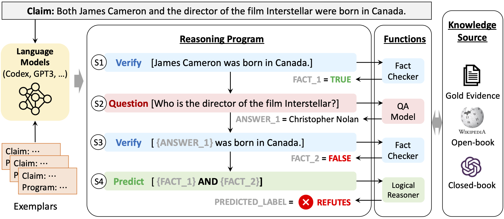

# ProgramFC
学生：陈林旭 学号：2310274028

论文原文地址 ACL 2023 Paper ["Fact-Checking Complex Claims with Program-Guided Reasoning"](https://arxiv.org/abs/2305.12744)

论文原文代码地址 https://github.com/mbzuai-nlp/ProgramFC

## 介绍


本文提出以一种新颖的事实核查模型——Program-Guided Fact-Checking（ProgramFC), 该模型将复杂的声明分解为可以使用专用功能库解决的更简单的子任务。本文作者首先利用大型语言模型的上下文学习能力生成推理程序，以指导验证过程。随后，通过将每个子任务委派给相应的子任务处理器来执行该程序。PROGRAMFC能够清晰地解释其推理过程，并且只需最少的训练数据。作者在两个具有挑战性的事实核查数据集上评估了ProgramFC，实验表明，在不同的证据可用性设置下，它比七个基线事实核查模型表现更好，并且提供了有助于人工调试的明确的输出程序。




首先安装所有必需的软件包:

```bash
pip install -r requirements.txt
```

## 准备数据集

如使用课堂提供的数据集GossipCop，请将该数据集文件夹GossipCop-LLM-Data-examples放在本项目根文件夹下。


如使用原文数据集 **HOVER**, 请执行下行命令:

```bash
bash prepare_hover_data.sh
```

如使用原文数据集 **FEVEROUS-S**, 请执行下行命令:

```bash
bash prepare_feverous_data.sh
```

下载后的原文使用的语料库将分别保存在 datasets/[DATASET_NAME]/claims 和 datasets/[DATASET_NAME]/corpus 文件夹中。


## 程序生成
利用课堂提供的GossipCop数据集生成程序，请执行下面命令：

```bash
python ./models/gossipcop_codeLlama_program_generator.py \ 
      --dataset_json_path "./GossipCop-LLM-Data-examples/gossipcop_v3-2_content_based_fake.json" \
      --output_path "./outputs" --num_examples 100 \
      --model "meta-llama/CodeLlama-7b-hf" \
      --save_path "./results/programs"      
```


利用原文提供的数据集生成程序，请执行下面命令:

```bash
python ./models/program_generator.py \
    --data_path ./datasets \
    --dataset_name "Dataset Name [HOVER | FEVEROUS]" \
    --num_programs_per_example "Number of reasoning programs for each sample." \
    --model_name text-davinci-003 \
    --num_eval_samples "Number of testing examples. -1 for the whole test set." \
    --api_key "Your OpenAI API Key" \
    --save_path ./results/programs
```

生成的json例子如下: 
```json
{
    "idx": 0,
    "id": "042339bf-0374-4ab3-ab49-6df5f12d868e",
    "claim": "The song recorded by Fergie that was produced by Polow da Don and was followed by Life Goes On was M.I.L.F.$.",
    "gold": "supports",
    "predicted_programs": [
      [
        [
          "fact_1 = Verify(\"M.I.L.F.$ was recorded by Fergie that was produced by Polow da Don.\")",
          "fact_2 = Verify(\"M.I.L.F.$ was was followed by Life Goes On.\")",
          "label = Predict(fact_1 and fact_2)"
        ]
      ]
    ]
}
```

## 程序执行

默认情况下上阶段生成的结果在results/programs文件夹中，运行生成的程序请执行以下代码：

```bash
export CUDA_VISIBLE_DEVICES="Your CUDA Device ID"

DATASET="Dataset Name [HOVER | FEVEROUS]"
MODEL="Model used for submodules (QA, Fact-Checker), default: flan-t5-xl"
SETTING="Experimental Settings [gold | open-book | close-book]"
PROGRAM_FILE_NAME="The program file name"
CACHE_DIR="Directory for cached models"

python ./models/program_execution.py \
    --dataset_name ${DATASET} \
    --setting ${SETTING} \
    --FV_data_path ./datasets \
    --program_dir ./results/programs \
    --program_file_name ${PROGRAM_FILE_NAME} \
    --corpus_index_path ./datasets/${DATASET}/corpus/index \
    --num_retrieved 5 \
    --max_evidence_length 4096 \
    --num_eval_samples -1 \
    --model_name google/${MODEL} \
    --output_dir ./results/fact_checking \
    --cache_dir ${CACHE_DIR}
```

这段命令生成的结果放在 `results/fact_checking/[model_name]_[setting]/[dataset_name].program.json`. 

## 评估

要评估生成结果，请运行以下命令:

```bash
python ./models/evaluate.py \
    --dataset_name "Dataset Name [HOVER | FEVEROUS]" \
    --FV_data_path ./datasets \
    --result_file "The result file path"
```

使用 `text-davinci-003` 作为程序生成器 (N=1) 的结果表：

| Setting | Sub-module Model | HOVER (2-hop) | HOVER (3-hop) | HOVER (4-hop) | FEVEROUS |
| :---: | :---: | :---: | :---: | :---: | :---: |
| gold | flan-t5-xl | 75.03 | 67.22 | 65.03 | 92.32 |
| open-book | flan-t5-xl | 70.55 | 60.38 | 56.81 | 67.16 |
| close-book | flan-t5-xl | 53.70 | 51.55 | 52.67 | 59.01 |


## 参考文献
如果您在研究中使用了本文内容，请按以下格式引用本文。

```
@article{pan2023factchecking,
    title = {Fact-Checking Complex Claims with Program-Guided Reasoning},
    author = {Liangming Pan and Xiaobao Wu and Xinyuan Lu and Anh Tuan Luu and William Yang Wang and Min-Yen Kan and Preslav Nakov},
    booktitle = {Proceedings of the 61th Annual Meeting of the Association for Computational Linguistics (ACL)},
    url = {https://arxiv.org/abs/2305.12744},
    year = {2023}
}
```

